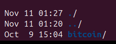
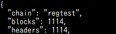
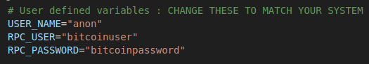
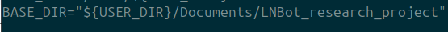

# LNTest

A testbed for a distributed Lightning network on one machine, using production grade Bitcoin Core and Core Lightning nodes orchestrated via Docker on a Bitcoin regtest environment.

# Table of Contents

- [LNTest](#lntest)
- [Table of Contents](#table-of-contents)
- [Architecture](#architecture)
- [Pre-requisites \& Compatibility](#pre-requisites--compatibility)
- [Set-up](#set-up)
  - [1. Create directory for LNBot and the Bitcoin-Core files](#1-create-directory-for-lnbot-and-the-bitcoin-core-files)
  - [2. Install Bitcoin-core](#2-install-bitcoin-core)
  - [3. Create bitcoin and lightning configs](#3-create-bitcoin-and-lightning-configs)
    - [3.1 Create bitcoin config](#31-create-bitcoin-config)
    - [3.2 Create lightning config](#32-create-lightning-config)
    - [3.3 Test Bitcoin environment](#33-test-bitcoin-environment)
  - [4. Setting up LNBot](#4-setting-up-lnbot)
    - [4.1 Clone the repo using git](#41-clone-the-repo-using-git)
    - [4.2 Copy and Modify config.env.template](#42-copy-and-modify-configenvtemplate)
  - [5. Downloading python dependencies](#5-downloading-python-dependencies)
  - [6. Running lntest](#6-running-lntest)
- [Commands and Scripts](#commands-and-scripts)
    - [Script](#script)
    - [lntest](#lntest-1)
    - [kill\_nodes.sh](#kill_nodessh)
    - [cleanup\_lightning\_nodes.sh](#cleanup_lightning_nodessh)
    - [restart\_bitcoin.sh](#restart_bitcoinsh)
- [Common Problems and Fixes](#common-problems-and-fixes)
    - [Bitcoin error](#bitcoin-error)
    - [Bitcoin lock error](#bitcoin-lock-error)


# Architecture

The botnet has 5 essential components. We have the main tester script that runs on the host machine, the Innocent Node, Botmaster Node and the CC Server Nodes, all of which run on individual docker containers running a custom docker image that is essentially the “elementsproject/lightningd:v25.09” image with python installed. Finally we have bitcoin core running a regtest server on the host machine to simulate the bitcoin network.

Each test automatically restarts the bitcoin server with a fresh wallet. In an effort to minimize the impact of previous tests on the next, all nodes and their associated resources are taken down after every test.

## Generated Data & Output

All experimental data is automatically saved to the `data/` directory. The testbed generates distinct files for each test configuration to ensure no data is overwritten or lost. However, this only applies per configuration as the exact same type of test will overwrite already present data.

### Data Structure
The filenames generally follow a specific convention based on the test parameters: `data/<variable>_<value>_<unique_id>_<type>`.

* **Propagation Data** (`*_time_data.json`)
  * Contains the precise time it took for each message to propagate through the network.
  * Includes metadata about the test (e.g., number of CC nodes, active nodes).
  * Records total setup time vs. total message sending time.

* **Topology Snapshots** (`*_topology_data.json`)
  * Captures the state of the Lightning Network at the end of the test.
  * Lists every node, its channels, channel capacity, and connection status.
  * Useful for visualizing the mesh network created during the experiment.

* **System Metrics** (`*_system_metrics.csv`)
  * Logs CPU and RAM usage of the host machine throughout the test duration.
  * Useful for analyzing the hardware overhead of running high-density docker simulations.

* **Execution Logs** (`*_total_times_log.json`)
  * A running log of how long each full test suite took to execute.
  * Helps track performance improvements or regressions in the testbed itself.
  * *Note: These files are timestamped by date (e.g., `YYYY-MM-DD_total_times_log.json`).*

### Logs
Detailed logs for debugging specific node behaviors are stored in:
* `NodeManagerComms/logs/`: Individual logs for every Command & Control (CC) node.
* `BotMasterComms/`: Logs for the Botmaster node actions.


# Pre-requisites & Compatibility

This testbed has been verified on the following Linux distributions:

* Ubuntu 24.04 LTS
* Ubuntu 25.04

This guide assumes that the user is starting from a fresh install of Ubuntu.

### Update Ubuntu

Be sure your system is up to date.

```bash
sudo apt update  
sudo apt upgrade
```

### Python

This project uses bash and python scripts. We will specifically create a virtual environment for this project.

Install venv for python so we can create the virtual environments.

```bash
sudo apt install python3-venv -y
```

### Docker

All lightning nodes will be individual docker containers. Reference the following guide, the pertinent instructions have been provided.

- [https://docs.docker.com/engine/install/ubuntu/#install-using-the-repository](https://docs.docker.com/engine/install/ubuntu/#install-using-the-repository) 

Install the Apt resources.

```bash
# Add Docker's official GPG key:
sudo apt update
sudo apt install ca-certificates curl
sudo install -m 0755 -d /etc/apt/keyrings
sudo curl -fsSL https://download.docker.com/linux/ubuntu/gpg -o /etc/apt/keyrings/docker.asc
sudo chmod a+r /etc/apt/keyrings/docker.asc

# Add the repository to Apt sources:
sudo tee /etc/apt/sources.list.d/docker.sources <<EOF
Types: deb
URIs: https://download.docker.com/linux/ubuntu
Suites: $(. /etc/os-release && echo "${UBUNTU_CODENAME:-$VERSION_CODENAME}")
Components: stable
Signed-By: /etc/apt/keyrings/docker.asc
EOF

sudo apt update
```

Actual installation of Docker.

```bash
sudo apt-get install docker-ce docker-ce-cli containerd.io docker-buildx-plugin docker-compose-plugin
```

Check the status of Docker, it should be running at this point.

```bash
sudo systemctl status docker
```

### Git

The repository containing the project will need to be cloned.

Install git using apt.

```bash
sudo apt install git
```
# Set-up

## 1. Create directory for LNBot and the Bitcoin-Core files

Navigate to the Documents directory in your home directory.

```bash
cd ~/Documents
```

Create a directory for LNBot and Bitcoin core to live in. In our testing environment we named it “LNBot_research_project”. 

```bash
mkdir LNBot_research_project  
cd LNBot_research_project
```

Note: If you name this directory something else, remember to modify the “config.env” file in the cloned LNBot repo.

## 2. Install Bitcoin-core

Download the bitcoin core tar file from [https://bitcoincore.org/en/download/](https://bitcoincore.org/en/download/) and move this file into the LNBot_research_project directory.

Extract the bitcoin core tar file here. You should be able to tab to complete the name.

```bash
tar -xvzf bitcoin-*
```

Rename the folder to bitcoin.

```bash
mv bitcoin-* bitcoin
```

Remove the tar file since it is no longer needed.

```bash
rm bitcoin-*
```

The directory should currently look like this.



Do not run bitcoin-core just yet.

## 3. Create bitcoin and lightning configs

### 3.1 Create bitcoin config

We will create a config file for the bitcoin core server to use. This way the bitcoin server will start as a regtest with the same server everytime. Change your directory to */.bitcoin*, if the directory doesn’t exist create it.

```bash
mkdir ~/.bitcoin #if the directory doesn’t exist  
cd ~/.bitcoin  
nano bitcoin.conf
```

We will set a few rules for the bitcoin server. This will define the network settings, how the server listens for incoming RPC connections and other settings to ensure smooth interactions with tools like the Lightning Network.

Copy and paste this into the bitcoin.conf file.

```ini
#Global Settings

regtest=1 #run as regtest
server=1 #enable rpc control
daemon=1 #run bitcoincore in the background
txindex=1 #index transactions for faster lookups
# Increase the system resources available
rpcworkqueue=512
rpcthreads=64

prune=n #keeps full blockchain for lightning compatibility

# REMEMBER to use the same bitcoin credentials
rpcuser=YourRpcUsername 
rpcpassword=YourRpcPassword

[regtest]

rpcport=8332
rpcallowip=127.0.0.1
rpcallowip=10.0.0.0/8
rpcallowip=172.0.0.0/8
rpcallowip=192.0.0.0/8
zmqpubrawblock=tcp://0.0.0.0:28332
zmqpubrawblock=tcp://0.0.0.0:28333
zmqpubhashblock=tcp://0.0.0.0:28334
whitelist=127.0.0.1

fallbackfee=0.00001
```

**Remember** the **username** and **password** you used here since we have to use the same credentials for the configs being passed into the lightning containers.

### 3.2 Create lightning config  
We will create a config file for the lightning daemons to use. We will set the rpcusername and rpcpassword that these C&C nodes will be using to connect to the bitcoin regtest network.

Change your directory to */.lightning*, if the directory doesn’t exist create it.

```bash
mkdir ~/.lightning #if the directory doesn’t exist  
cd ~/.lightning
```

Here we create the configuration file for lighting.

```bash
nano lightning.conf
```

Copy and paste the following:

```ini
network=regtest #we are on a regtest network

# REMEMBER to use the same bitcoin credentials
bitcoin-rpcuser=YourRpcUsername
bitcoin-rpcpassword=YourRpcPassword
bitcoin-rpcconnect=127.0.0.1
bitcoin-rpcport=8332

log-level=debug
```

The **username** and **password** here should match the credentials placed into bitcoin.conf.

At this point the configuration for the testing setup on the host machine is complete. The last requirement is to modify the testing files and double check that the path files are correct relative to your directory paths.

### 3.3 Test Bitcoin environment

We will start the bitcoin server and verify that it is starting as a regtest environment.

Change directories to where the bitcoin-core files are located. This assumes you followed the exact same file structure as we did.

```bash
cd ~/Documents/LNBot_research_project/bitcoin/bin  
./bitcoind 
```

This should start the bitcoin server. Now we verify that this is running in a regtest environment. Run getblockchaininfo to get information on the currently running server.

```bash
./bitcoin-cli getblockchaininfo  
```

We’re looking for this specifically. That “chain” is “regtest”. Once this is verified we can stop the server and we can now set up LNBot.

```bash
./bitcoin-cli stop
```

Note: You can add bitcoind and bitcoin-cli to your path environment if you want to start and stop bitcoin-core without having to run them in this directory specifically.

## 4. Setting up LNBot

Using git, we will download the repo containing LNTest. Keep in mind that this is a self contained testing suite and will not communicate outside of the host machine, hence why we did not need to open up any ports in the previous steps. We will then copy the “config.env.template” to “config.env” and modify the variables inside the file to match your unique system.

It is important to note that the script uses hard paths to find the necessary files to run. This is because we use sudo to run the tester files (docker requires sudo unless you are part of the docker group) and so the tester file will look in “root”s home directory for those files unless a hard path is used instead.

### 4.1 Clone the repo using git

```bash
cd ~/Documents/LNBot_research_project  
git clone https://github.com/LN-Testbed/DSN2026.git LNBot
```

The final directory structure inside the LNBot_research_project should appear as follows:  


### 4.2 Copy and Modify config.env.template

With LNBot now on your system, copy the config.env.template as config.env. This file is located at the root level of LNBot.

```bash
cd LNBot  
cp config.env.template config.env
```

modify the config.env file located in the root folder of LNBot. The first three variables are the most important, ensure these match the system you’re currently on.

```bash
nano config.env
```

USER_NAME : Needs to match the current user account.   
In this example USER_NAME should be “anon”. 

RPC_USER: Should match what’s in bitcoin.conf and lightning.conf  
RPC_PASSWORD: Should match what’s in bitcoin.conf and lightning.conf  


Change the “BASE_DIR” to match your directory structure if you did not use the same naming conventions.  
This should be the path to where the bitcoin and LNBot directories are living.  


## 5. Downloading python dependencies

From here we’re going to create a virtual environment for python, activate it and then install the required libraries.

Inside the LNBot directory:

```bash
python3 -m venv venv  
source venv/bin/activate  
pip install -r requirements.txt
```

## 6. Running lntest

The python script “lntest” is the main script for testing the Lightning Botnet. It is responsible for creating the containers, managing memory, sending the initial botnet commands for propagation and then tearing everything down for subsequent tests.

Because this script manages memory and deals with running docker files, it must be run as sudo, however doing so will use the root’s path for python, which means that we lose the dependencies we just installed. To use the correct interpreter, we need to run sudo with an absolute path to the correct python interpreter. Run lntest.

```bash
sudo venv/bin/python lntest.py --small
```

This will start a small gamut of tests to see if everything is set up correctly. Progress can be monitored in the logs in the log directory, with the status of each node stored in the status directory.

Data collected will be in the “data/” directory.

Important: Remember to save your data to a separate directory after each run since the script will overwrite any data that is stored there.

# Commands and Scripts

An overview of the useful scripts contained in this setup. This section will be written as:

### Script

How to run script  
Description of what this script does.

### lntest
```bash
sudo venv/bin/python lntest.py
```  
Use “-h” to bring up the help screen to see the possible commands.  
Can choose between “--full”, “--small” and “--test”.  
“--full”

- Run all tests from start to finish. Change the parameters to change how to the tests runs

“--small”

- Run a small gamut of tests to make sure that the scripts are working properly

“--test”

- Run a specific series of tests. Choose between:  
  - 1: Changing number of cc nodes  
  - 2: Changing number of active nodes  
  - 3: Changing number of cc nodes the botmaster will connect to  
  - 4: Changing number of locations the botmaster will connect to (fixed to top, middle and bottom)

Optional parameters that can be changed for the tests. Does not affect “--small” tests.  
Behavior:  
Optional parameters will affect all tests. All tests will start iterations at the provided values and will hold at provided values for all other tests.  
Example:  
Having “--num_cc 30” will start num_cc tests at 30 and will create 30 C&C servers when testing other parameters.

```
--num_cc #
```

- Number of CC nodes for the tests

```
--active_nodes #
```

- Number of active nodes

```
--bm_cc #
```

- Number of channels the botmaster will create

```
--bm_pos #
```

- Position where the botmaster will connect to in the network. Percentage based
  - <0 = random
  - 0 = 0% = bottom / oldest
  - 50 = 50% = middle
  - 100 = 100% = top / youngest
  - >100 = bottom + middle + top (bm_cc each)

```
--max_msg #
```

- Number of messages to send per test

```
--max_range #
```

- Max range for this test

```
--takedown
```

- Make this test a takedown test. 10% of the nodes will be forcefully shut down before sending messages

### kill_nodes.sh

```bash
sudo ./kill_nodes.sh
```  
Stops and removes all docker nodes created during the test.  
Clears out shared memory.  
Removes the persistent docker directories so that no files interfere with further tests.  
Does not remove logs in the NodeManagerComms/logs directory.

### cleanup_lightning_nodes.sh
```bash
sudo ./cleanup_lightning_nodes.sh  
```
Kill nodes except it also clears out the logs.   
This is the script that the lntest script calls after recording each test.

### restart_bitcoin.sh
```bash
sudo ./restart_bitcoin.sh  
```
Stops bitcoin-core.  
Deletes regtest data so we start fresh.  
Creates a new wallet for the tests, since by default bitcoind does not create a wallet.  
Starts a mineBlocks bitcoin miner in the background.

Note: Does not kill any bitcoin miner that may be still running. That is done in the lntest script.

# Common Problems and Fixes

Some common problems that can pop up from time to time.

### Bitcoin error

If you run into bitcoin errors as the testing starts, usually with a description of loading wallet or some such. This is usually because bitcoin core was already running and the script couldn’t shut it down properly or the device was shutdown while bitcoin-core was still running.

You will need to find the pid of bitcoin-core and kill it, sometimes forcefully if it will not exit out with a normal kill command.
You may need to run pkill as sudo.

```bash
pkill -9 bitcoind
```

### Bitcoin lock error

If you start the tester and it states that it can’t get a lock on the regtest folder, that means bitcoin-core was not shutdown automatically by the scripts. Crtl+c to exit the tester and retry, it usually clears up immediately.
